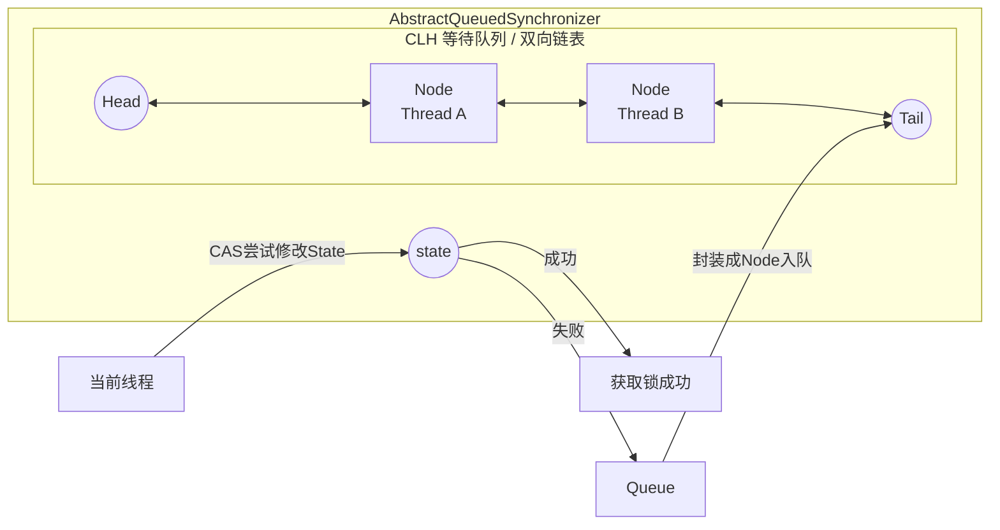

# JUC 经典面经

JUC = java.util.concurrent
核心分为五大模块：

1. 原子类（Atomic）
2. 锁（Lock）
3. 线程池（Executor）
4. 并发容器
5. AQS 核心框架

## volatile

volatile 通过内存屏障机制保证可见性和有序性，但不保证复合操作的原子性，适用于状态标志位和双重检查锁等场景。

### volatile 关键字的作用是什么？

volatile 保证：

- 可见性
- 止指令重排序

不保证：原子性（除了单次读写）

### volatile 为什么能保证可见性？

核心原理：

- 写 volatile 时，会把工作内存刷新到主内存
- 读 volatile 时，会强制从主内存读取

底层依赖：内存屏障（Memory Barrier）

### volatile 和 synchronized 区别？

volatile 是轻量级同步
synchronized 是重量级锁

| 对比   | volatile | synchronized |
| ------ | -------- | ------------ |
| 可见性 | 有       | 有           |
| 原子性 | 无       | 有           |
| 重排序 | 禁止     | 禁止         |
| 阻塞   | 不阻塞   | 会阻塞       |

### volatile 能替代锁吗？

不能。

适用条件必须同时满足：

1. 写操作不依赖当前值
2. 不需要复合操作
3. 不需要保持多个变量一致性

否则必须加锁。

## synchronized

### synchronized 锁升级流程?

在 JDK 1.6 之后，synchronized 引入了 锁优化机制，锁状态会根据竞争情况逐步升级：

```text
无锁 → 偏向锁 → 轻量级锁 → 重量级锁
```

锁只能升级，不能降级
锁信息存储在对象头的 Mark Word 中

Mark Word 会根据锁状态存储不同信息：

| 状态     | 存储内容              |
| -------- | --------------------- |
| 无锁     | hashCode、GC 分代年龄 |
| 偏向锁   | 线程 ID               |
| 轻量级锁 | 指向栈中锁记录        |
| 重量级锁 | 指向 Monitor 对象     |

锁升级流程：

1. 无锁（对象刚创建时），如果没有线程竞争，保持无锁。
2. 偏向锁（Biased Lock），触发条件：第一次有线程进入 synchronized 块，没有竞争（单线程进入同步块）
3. 轻量级锁（Lightweight Lock），触发条件：存在竞争但线程数量不多。 特点： 基于 CAS + 自旋，不阻塞线程，不涉及内核态切换
4. 重量级锁（Heavyweight Lock），当轻量级锁自旋次数过多或者竞争严重时会升级成重量级锁，特点：成本高，但稳定。

锁升级流程图总结：

```text
无锁
  ↓
偏向锁（单线程）
  ↓（有竞争）
轻量级锁（CAS + 自旋）
  ↓（自旋失败）
重量级锁（Monitor + 阻塞）
```

锁升级机制在 JDK 版本中的变化：

- JDK 1.6：引入锁优化
- JDK 15：默认关闭偏向锁
- JDK 18：完全移除偏向锁

原因：

- 在现代多线程环境下
- 偏向锁收益变小
- 实现复杂

> 总结:
>
> synchronized 在 JDK1.6 之后引入锁升级机制：`无锁 → 偏向锁 → 轻量级锁 → 重量级锁`。
>
> 偏向锁适用于单线程场景，轻量级锁基于 CAS 和自旋，适用于低竞争场景；当竞争激烈时升级为重量级锁，通过 Monitor 进行线程阻塞。
>
> 锁信息存储在对象头的 Mark Word 中，`锁只能升级不能降级`。
>
> 这些优化大幅提升了 synchronized 在低竞争环境下的性能。

## CAS

### CAS 是什么？ CAS 原理？

CAS（Compare And Swap），即 `比较并交换`，是一种`无锁并发控制机制`。在更新变量时，先比较当前值是否等于预期值，如果相等则更新，否则不更新。是一种`乐观锁机制`

### 理解 ABA 问题？

ABA 问题是指在使用 CAS 时，变量值从 A 变为 B 又变回 A，CAS 无法感知中间的变化，从而误判为未修改，可能导致逻辑错误。
在无锁数据结构（如无锁栈、队列）中可能造成严重问题，如数据丢失或结构异常。
解决方案是引入版本号机制，例如使用 AtomicStampedReference，通过比较值和版本号来避免 ABA 问题。

## AQS

### 什么是 AQS？

AQS 全称 AbstractQueuedSynchronizer（抽象队列同步器），它是 JUC 包中用于构建锁和同步器的基础框架。

我们熟知的 ReentrantLock、CountDownLatch、Semaphore、CyclicBarrier 等同步工具，其内部实现都依赖于 AQS。

AQS 使用了模板方法模式。AQS 定义了顶层逻辑（入队、出队、阻塞），而具体的“尝试获取锁”和“尝试释放锁”的逻辑由子类实现。

一句话总结： AQS 是一个用来构建锁和同步器的框架，它利用一个 volatile int 变量作为共享资源（状态），并维护了一个 FIFO（先进先出）的队列来管理那些竞争资源失败的线程。

AQS 的核心思想可以概括为：State + CLH 变体队列。 `同步状态 + 等待队列`

1. State (同步状态)：

   - 使用 volatile int state 成员变量来表示同步状态。
   - 通过内置的 FIFO 队列来完成资源获取线程的排队工作。
   - 通过 CAS (Compare And Swap) 操作来修改 state 的值，保证原子性。

2. CLH 队列 (等待队列)：

   - AQS 内部维护了一个双向链表（CLH 锁的变体）。
   - 当线程获取同步状态失败时，AQS 会将当前线程封装成一个 Node 节点，并将其加入到队列尾部，然后阻塞该线程。
   - 当同步状态释放时，会唤醒队列头部的后继节点，使其再次尝试获取同步状态。


