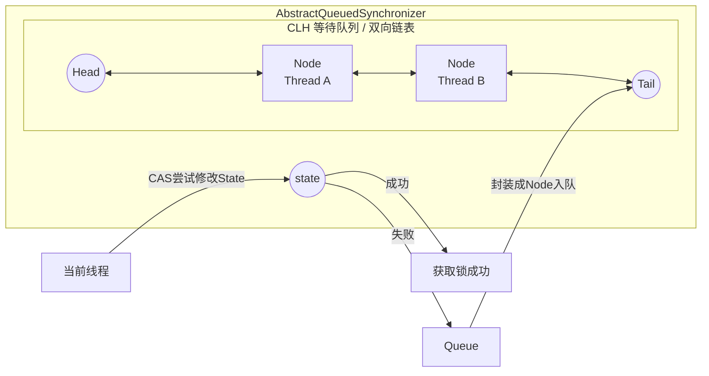

# JUC 经典面经

JUC = java.util.concurrent
核心分为五大模块：

1. 原子类（Atomic）
2. 锁（Lock）
3. 线程池（Executor）
4. 并发容器
5. AQS 核心框架

## 线程

### 创建线程方式？

1. 继承 Thread，重写 run 方法
2. 实现 Runable，通过 new Thread(runable)方式创建
3. 实现 Callable ，创建 FutureTask，通过 new Thread(futureTask)方式创建
4. 使用线程池

### Java 线程的运行流程（生命周期）是怎样的？

在 Java 中，线程的生命周期由 Thread.State 枚举定义，一共有 六种状态：

1. new:线程对象被创建，但还没有调用 start() 方法。
2. runnable:当调用 start() 方法后，线程进入 RUNNABLE 状态。RUNNABLE 状态实际上包含两个操作系统状态：Ready（就绪）和 Running（运行）
3. blocked：尝试获取锁失败时进入 BLOCKED 状态。
4. waiting：线程主动进入等待状态，需要 其他线程唤醒。
5. timed_waiting：超时等待
6. terminated：线程生命周期结束，不能再次启动。

线程生命周期转换图:

```text
NEW
  │
start()
  │
RUNNABLE
  │
  ├─获取锁失败 → BLOCKED
  │
  ├─wait/join → WAITING
  │
  ├─sleep → TIMED_WAITING
  │
  ↓
TERMINATED
```

### join 和 wait 的区别？

join() 和 wait() 都可以让线程进入等待状态

1. join 是当前挂起等待调用 join 的线程结束，wait 是等待某个线程唤醒
2. wait 必须在 synchronized 块中调用，join 没有限制
3. wait 是 Object 的方法，join 是 Thread 的方法
4. wait 需要通过 notify 或者 notifyAll 才能唤醒，join 在结束后自动唤醒

### Callable 和 Runnable 创建线程的方式有什么区别？

1. Runnable
   - 无返回值
   - 不可抛异常
   - 实现 run 方法

2. Callable
   - 有返回值
   - 可抛异常
   - 实现 call 方法

### start 和 run 区别？

start() 和 run() 的核心区别在于 是否真正创建新线程。

1. run() 方法：run() 是 Thread 类实现 Runnable 接口后的一个普通方法。本质上只是一次普通的方法调用，仍然在当前线程中执行，并不会创建新的线程。

2. start() 方法：start() 才是启动线程的入口方法，调用 start() 后：
   - JVM 会调用 start() 内部的 native 方法
   - 由 操作系统创建新的线程
   - 线程进入 RUNNABLE 状态
   - JVM 线程调度器最终会执行该线程的 run() 方法
   - `start() -> 创建新线程 -> JVM 调度 -> 执行 run()`
   - 不能多次调用 start()，会抛异常`IllegalThreadStateException`

### sleep 和 wait 区别？

sleep() 和 wait() 都可以让线程进入阻塞状态，它们的区别在于：

1. 所属类不同：
   - sleep() 是 Thread 类的静态方法
   - wait() 是 Object 类的方法，因此任何对象都可以调用 wait()

2. 是否释放锁：
   - sleep() 在阻塞期间 不会释放锁
   - wait() 在调用后会 释放当前对象锁，并让线程进入等待队列

3. 使用条件不同
   - sleep() 可以在任何地方调用，不需要同步环境
   - wait() 必须在 `synchronized 同步代码块`或`同步方法中`调用，否则会抛出 IllegalMonitorStateException

4. 唤醒方式不同
   - sleep() 在指定时间结束后会 自动恢复运行
   - wait() 需要其他线程调用：`notify()`或者`notifyAll()`才能被唤醒，唤醒后线程需要重新竞争锁才能继续执行。

### notify 和 notifyAll 区别？

notify() 和 notifyAll() 都是 Object 类提供的线程通信方法，用于唤醒调用 wait() 进入等待状态的线程，它们必须在 synchronized 同步代码块或同步方法中调用。

二者的核心区别主要体现在 唤醒线程数量不同。

1. notify() 会从当前对象的 等待队列（Wait Set）中`随机唤醒一个线程`。
2. notifyAll() 会`唤醒等待队列中的所有线程`。这些线程会全部进入锁竞争状态，但最终只有一个线程能获得锁，其余线程依旧会被阻塞

## volatile

volatile 通过内存屏障机制保证可见性和有序性，但不保证复合操作的原子性，适用于状态标志位和双重检查锁等场景。

### volatile 关键字的作用是什么？

volatile 保证：

- 可见性
- 止指令重排序

不保证：原子性（除了单次读写）

### volatile 为什么能保证可见性？

核心原理：

- 写 volatile 时，会把工作内存刷新到主内存
- 读 volatile 时，会强制从主内存读取

底层依赖：内存屏障（Memory Barrier）

### volatile 和 synchronized 区别？

volatile 是轻量级同步
synchronized 是重量级锁

| 对比   | volatile | synchronized |
| ------ | -------- | ------------ |
| 可见性 | 有       | 有           |
| 原子性 | 无       | 有           |
| 重排序 | 禁止     | 禁止         |
| 阻塞   | 不阻塞   | 会阻塞       |

### volatile 能替代锁吗？

不能。

适用条件必须同时满足：

1. 写操作不依赖当前值
2. 不需要复合操作
3. 不需要保持多个变量一致性

否则必须加锁。

## synchronized

### synchronized 底层原理？

synchronized 是 Java 提供的 内置锁机制，它的底层是通过 对象监视器（Monitor）机制实现的。

在字节码层面，synchronized 会被编译成两条 JVM 指令：`monitorenter`和`monitorexit`。

当线程进入 synchronized 代码块时，会执行 monitorenter 指令去尝试获取对象的 Monitor 锁，如果获取成功就进入临界区执行代码；执行完成或发生异常时，会执行 monitorexit 释放锁。

synchronized 的锁信息存储在 对象头（Object Header）中的 `Mark Word` 中。

synchronized 还通过`内存屏障（Memory Barrier）`保证：`可见性`和`有序性`

`synchronized 的底层 = Monitor机制 + 对象头Mark Word + 锁升级优化 + 内存屏障保证可见性。`

### synchronized 锁升级流程?

在 JDK 1.6 之后，synchronized 引入了 锁优化机制，锁状态会根据竞争情况逐步升级：

```text
无锁 → 偏向锁 → 轻量级锁 → 重量级锁
```

锁只能升级，不能降级
锁信息存储在对象头的 Mark Word 中

Mark Word 会根据锁状态存储不同信息：

| 状态     | 存储内容              |
| -------- | --------------------- |
| 无锁     | hashCode、GC 分代年龄 |
| 偏向锁   | 线程 ID               |
| 轻量级锁 | 指向栈中锁记录        |
| 重量级锁 | 指向 Monitor 对象     |

锁升级流程：

1. 无锁（对象刚创建时），如果没有线程竞争，保持无锁。
2. 偏向锁（Biased Lock），触发条件：第一次有线程进入 synchronized 块，没有竞争（单线程进入同步块）
3. 轻量级锁（Lightweight Lock），触发条件：存在竞争但线程数量不多。 特点： 基于 CAS + 自旋，不阻塞线程，不涉及内核态切换
4. 重量级锁（Heavyweight Lock），当轻量级锁自旋次数过多或者竞争严重时会升级成重量级锁，特点：成本高，但稳定。

锁升级流程图总结：

```text
无锁
  ↓
偏向锁（单线程）
  ↓（有竞争）
轻量级锁（CAS + 自旋）
  ↓（自旋失败）
重量级锁（Monitor + 阻塞）
```

锁升级机制在 JDK 版本中的变化：

- JDK 1.6：引入锁优化
- JDK 15：默认关闭偏向锁
- JDK 18：完全移除偏向锁

原因：

- 在现代多线程环境下
- 偏向锁收益变小
- 实现复杂

> 总结:
>
> synchronized 在 JDK1.6 之后引入锁升级机制：`无锁 → 偏向锁 → 轻量级锁 → 重量级锁`。
>
> 偏向锁适用于单线程场景，轻量级锁基于 CAS 和自旋，适用于低竞争场景；当竞争激烈时升级为重量级锁，通过 Monitor 进行线程阻塞。
>
> 锁信息存储在对象头的 Mark Word 中，`锁只能升级不能降级`。
>
> 这些优化大幅提升了 synchronized 在低竞争环境下的性能。

## CAS

### CAS 是什么？ CAS 原理？

CAS（Compare And Swap）是一种`无锁并发机制`，它通过 CPU 提供的原子指令（如 cmpxchg）实现比较并交换操作。CAS 会比较内存中的值和期望值，如果相同则更新为新值，否则操作失败。由于`整个比较和更新过程是 CPU 保证的原子操作`，因此可以在多线程环境下保证线程安全。Java 中的 Atomic 类（如 AtomicInteger）就是通过 Unsafe 或 VarHandle 调用底层 CAS 指令实现的。不过 CAS 也存在 `ABA 问题`、`自旋开销大`以及`只能保证单变量原子性`等缺点。

### 理解 ABA 问题？

ABA 问题是指在使用 CAS 时，变量值从 A 变为 B 又变回 A，CAS 无法感知中间的变化，从而误判为未修改，可能导致逻辑错误。
在无锁数据结构（如无锁栈、队列）中可能造成严重问题，如数据丢失或结构异常。
解决方案是引入版本号机制，例如使用 `AtomicStampedReference`，通过比较值和版本号来避免 ABA 问题。

## AQS

### 什么是 AQS？

AQS 全称 AbstractQueuedSynchronizer（抽象队列同步器），它是 JUC 包中用于构建锁和同步器的基础框架。

我们熟知的 ReentrantLock、CountDownLatch、Semaphore、CyclicBarrier 等同步工具，其内部实现都依赖于 AQS。

AQS 使用了模板方法模式。AQS 定义了顶层逻辑（入队、出队、阻塞），而具体的“尝试获取锁”和“尝试释放锁”的逻辑由子类实现。

一句话总结： AQS 是一个用来构建锁和同步器的框架，它利用一个 volatile int 变量作为共享资源（状态），并维护了一个 FIFO（先进先出）的队列来管理那些竞争资源失败的线程。

AQS 的核心思想可以概括为：State + CLH 变体队列。 `同步状态 + 等待队列`

1. State (同步状态)：
   - 使用 volatile int state 成员变量来表示同步状态。
   - 通过内置的 FIFO 队列来完成资源获取线程的排队工作。
   - 通过 CAS (Compare And Swap) 操作来修改 state 的值，保证原子性。

2. CLH 队列 (等待队列)：
   - AQS 内部维护了一个双向链表（CLH 锁的变体）。
   - 当线程获取同步状态失败时，AQS 会将当前线程封装成一个 Node 节点，并将其加入到队列尾部，然后阻塞该线程。
   - 当同步状态释放时，会唤醒队列头部的后继节点，使其再次尝试获取同步状态。



### AQS 为什么要使用 CLH 队列?

CLH（Craig, Landin, and Hagersten）队列是一种 基于链表的 FIFO 队列锁结构。在 AQS 中，它是一个双向链表的等待队列

1. 减少锁竞争

   如果没有队列，线程获取锁失败时可能会：疯狂 CAS 重试。使用 CLH 队列后：获取锁失败的线程 进入等待队列，只有 队头线程 才会尝试获取锁，极大降低 CAS 竞争。

2. FIFO（先进先出） 公平排队，这也是 公平锁实现的基础。
3. 前驱节点负责唤醒：避免唤醒所有线程

> AQS 使用 CLH 队列管理等待线程，其核心目的是 减少锁竞争、实现 FIFO 排队、并通过前驱节点唤醒机制避免惊群效应。
>
> 当线程获取锁失败时会进入 CLH 队列并被 park 挂起，只有前驱节点释放锁时才会被唤醒，从而提高并发性能。

## Java 同步锁

### ReentrantLock（可重入锁） 原理？

可重入锁（ReentrantLock）指的是：同一个线程在已经持有锁的情况下，可以再次获取该锁，而不会被阻塞。

ReentrantLock 的底层是基于： AQS（AbstractQueuedSynchronizer）实现的独占锁。 AQS 主要通过一个 state 状态变量 来表示锁状态。

核心字段：`state` 锁状态（重入次数）和 `exclusiveOwnerThread` 当前持有锁的线程

加锁流程:

- 尝试获取锁，若 state==0 则锁没有被占有，则设置 state==1 并设置当前持有锁线程
- 判断是否可重入：exclusiveOwnerThread == 当前线程，同一线程再次获取锁：state++，实现可重入
- 获取失败进入等待队列

释放锁流程：state--,只有当 state==0 时方真正释放锁

ReentrantLock 可重入的核心机制是：

1. `基于 AQS 框架`
2. `使用 state 记录重入次数`
3. 使用 exclusiveOwnerThread `记录锁持有线程`

### 独占锁原理？

独占锁（Exclusive Lock）：同一时刻只允许一个线程持有锁，其他线程必须等待。`ReentrantLock`、`synchronized`都是独占锁

独占锁的核心原理是：通过 CAS 修改 AQS 的 state 状态实现锁竞争，获取失败的线程进入 CLH 队列排队并 park 挂起，当锁释放时通过 unpark 唤醒队列中的下一个线程，从而实现线程安全的互斥访问。

### 共享锁原理？

允许多个线程同时获取锁，只要资源没有被耗尽。CountDownLatch、ReadWriteLock、Semaphore 都是共享锁。共享锁同样基于 AQS（AbstractQueuedSynchronizer） 实现。

共享锁的核心原理是：基于 AQS 的 state 表示资源数量，线程通过 CAS 减少 state 获取资源，当资源不足时进入 CLH 队列挂起。资源释放时通过 releaseShared + 传播机制 唤醒多个等待线程，从而实现多个线程同时访问资源。

### 公平锁和非公平锁？

公平锁：所有线程必须排队获取锁，`new ReentrantLock(true)可以创建公平锁`

- 公平锁遵循 先来先得（FIFO） 原则
- 获取锁前会先判断 AQS 队列中是否已有等待线程：
  - 如果有等待线程：当前线程必须进入队列排队
  - 如果没有：尝试获取锁

非公平锁：允许线程插队，ReentrantLock 默认是 非公平锁，synchronized 也是 非公平锁

- 当线程请求锁时：先直接 CAS 抢锁，抢不到才进入 AQS 队列

### 为什么非公平所的性能比较高？

非公平锁性能更高，主要原因在于它允许线程在获取锁时 直接尝试抢占锁，而不是严格按照队列顺序执行。

在 AQS 实现中，非公平锁在获取锁时会先通过 CAS 操作直接尝试修改 state 获取锁，如果成功则立即获得锁；只有在获取失败时才进入 AQS 队列等待。而公平锁在获取锁之前会先检查队列中是否存在等待线程，如果有则必须进入队列排队。

这种差异带来了三个性能优势：

1. 第一，减少线程阻塞与唤醒。

   公平锁必须唤醒队列头节点线程，而线程唤醒涉及操作系统调度和线程状态切换，成本较高。非公平锁可能被正在运行的线程直接获取，从而减少唤醒操作。

2. 第二，减少上下文切换。

   公平锁需要将执行权从当前线程切换到队列中的下一个线程，而非公平锁允许当前 CPU 上正在运行的线程直接获取锁，可以避免线程切换带来的开销。

3. 第三，提高 CPU 利用率。

   当锁释放时，如果当前 CPU 上有线程正在运行，非公平锁允许该线程立即获取锁，而公平锁必须等待队列中的线程被唤醒并调度执行，这会降低吞吐量。

因此，在大多数场景下，非公平锁的整体吞吐量要高于公平锁，这也是 ReentrantLock 默认使用非公平锁的原因。

### synchronized 和 ReentrantLock 区别？

synchronized 是 java 关键字，锁范围是方法或代码块，由 JVM 层面实现，锁的获取和释放由 JVM 自动完成。

ReentrantLock 是 JDK 提供的一个锁实现类，需要主动 lock 加锁，unlock 解锁，锁范围粒度可控，可中断锁。
