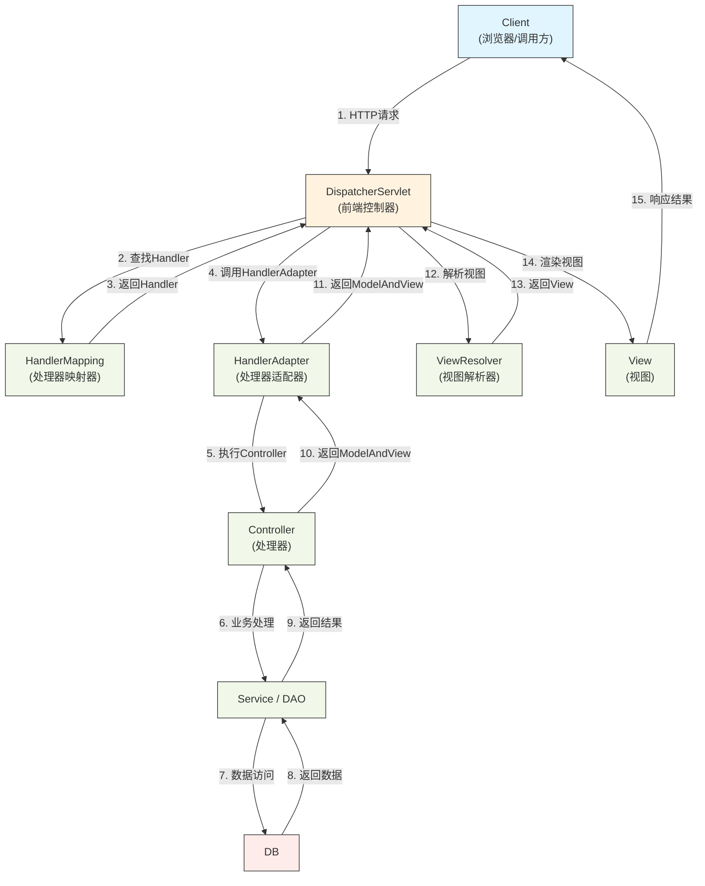
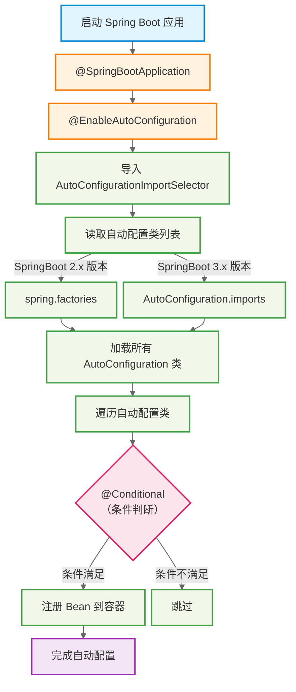

# SpringBoot经典面经

## SpringMVC工作流程详解？



完整工作流程：

```text
请求 → DispatcherServlet
    → HandlerMapping（找Controller）
    → HandlerAdapter（执行方法）
    → 参数绑定
    → Controller执行
    → 返回值处理
    → 视图解析 / JSON转换
    → 响应客户端
```

SpringMVC 的核心是基于前端控制器 `DispatcherServlet` 的请求分发机制。

当请求进入后，首先由 DispatcherServlet 接收，然后通过 `HandlerMapping` 根据 URL 查找到对应的 `Controller` 方法，同时获取拦截器链。

接着通过 `HandlerAdapter` 调用具体的 Controller 方法。在调用之前，会通过参数解析器完成请求参数到方法参数的绑定。

方法执行完成后，会通过返回值处理器对结果进行处理。如果是视图类型，则通过 `ViewResolver` 解析出具体视图并渲染；如果是 JSON，则通过 HttpMessageConverter 直接写回响应。

在整个过程中，还可以通过 HandlerInterceptor 在方法执行前后进行扩展处理。

整体流程体现了 SpringMVC 的核心设计思想：前端控制器模式 + 适配器模式 + 责任链模式。

## SpringBoot自动装配的原理和流程？

整体流程总结：

1. 启动 SpringBoot
2. 解析 `@SpringBootApplication`
3. 触发 `@EnableAutoConfiguration`
4. 执行 `AutoConfigurationImportSelector`
5. 加载所有自动配置类（SPI）
6. 根据 `@Conditional` 过滤
7. 将符合条件的 Bean 注册到容器



SpringBoot 的自动装配核心是基于 `@EnableAutoConfiguration` 实现的。
启动时，通过 `@Import` 导入 `AutoConfigurationImportSelector`，它会从 `spring.factories（SpringBoot 2.x）`或者 `AutoConfiguration.imports（SpringBoot 3.x）`中加载所有自动配置类。

加载之后，并不是全部生效，而是通过 `@Conditional` 条件注解进行筛选，比如根据类路径、Bean 是否存在、配置项等条件，决定是否装配。

最终符合条件的自动配置类会向 Spring 容器中注册 Bean，从而实现“开箱即用”。

同时，SpringBoot 遵循“约定大于配置”，并且通过 `@ConditionalOnMissingBean` 保证用户自定义配置优先生效，从而实现可扩展和可覆盖。

总体来说，SpringBoot 自动装配的本质就是：SPI + 条件装配 + Bean 注册机制。
